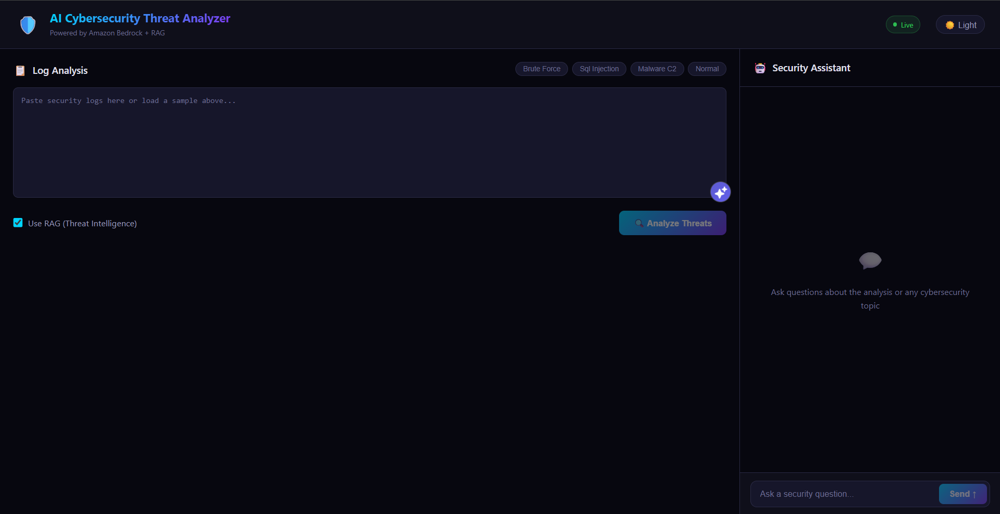
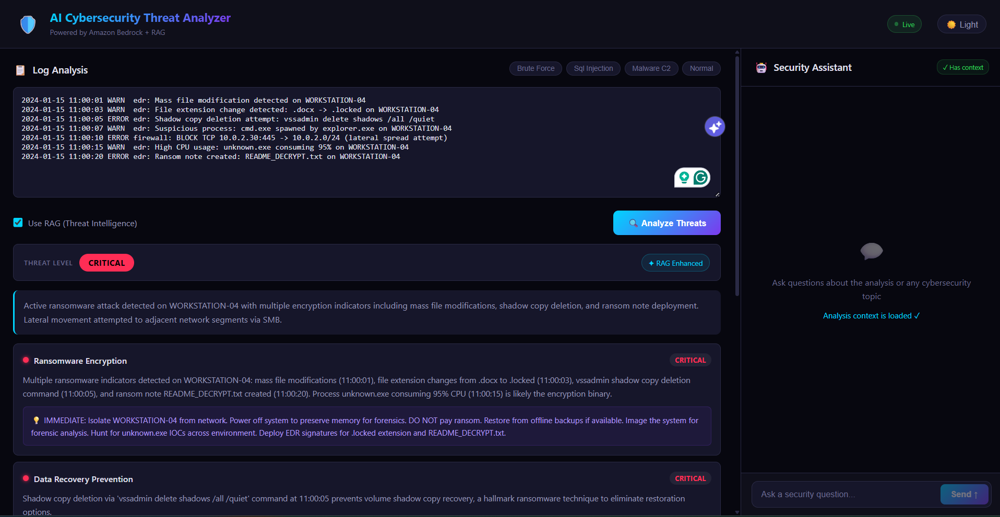
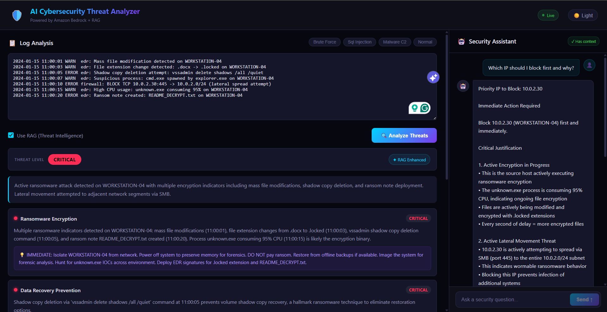

# 🛡️ AI Cybersecurity Threat Analyzer

A Generative AI-powered cybersecurity log analysis platform that uses **Amazon Bedrock**, **Claude**, **Amazon Titan Embeddings**, and **RAG** to detect suspicious log patterns, classify threat severity, and generate incident response recommendations.

---

## Table of Contents

- [Overview](#overview)
- [Screenshots](#screenshots)
- [Architecture](#architecture)
- [Features](#features)
- [Tech Stack](#tech-stack)
- [Why This Stack](#why-this-stack)
- [Project Structure](#project-structure)
- [Prerequisites](#prerequisites)
- [Setup & Running](#setup--running)
- [Environment Variables](#environment-variables)
- [API Reference](#api-reference)
- [How It Works](#how-it-works)
- [Sample Logs](#sample-logs)
- [Threat Intelligence Knowledge Base](#threat-intelligence-knowledge-base)
- [Deployment Plan](#deployment-plan)
- [Limitations](#limitations)
- [Future Improvements](#future-improvements)

---

## Overview

This application accepts raw security logs such as SSH logs, web server logs, firewall logs, and EDR-style alerts, then uses a large language model on Amazon Bedrock to analyze them for possible threats.

The system enhances analysis using Retrieval-Augmented Generation (RAG). It retrieves relevant threat intelligence documents before sending the final prompt to the model, helping produce more accurate and contextual security findings.

A built-in Security Assistant chat allows users to ask follow-up questions about detected threats, recommended mitigations, and incident response steps.

---

## Screenshots

> Add your screenshots inside a `screenshots/` folder and update the image paths below.

### Threat Analysis Dashboard


### AI Incident Report


### Security Assistant Chat


---

## Architecture

```text
Browser (React + Vite)
        │
        │  HTTP
        ▼
Express Backend (Node.js + Express)
        │
        ├── BedrockService
        │     └── Amazon Bedrock → Claude model for threat analysis and chat
        │
        ├── RAGService
        │     ├── Amazon Bedrock → Titan Embed Text v2 for embeddings
        │     └── Cosine similarity search over in-memory vector index
        │
        └── LogAnalyzer
              └── Combines logs + RAG context + prompt template for structured JSON output
```

---

## Features

- **Log Analysis** — Paste security logs and receive structured findings including severity, attack category, evidence, and remediation steps.
- **Threat Level Rating** — Classifies overall threat level as `CRITICAL`, `HIGH`, `MEDIUM`, `LOW`, or `NONE`.
- **RAG Enhancement** — Retrieves the top relevant threat intelligence documents using semantic similarity before invoking the model.
- **Security Assistant Chat** — Ask follow-up questions about detected threats with the current analysis context injected automatically.
- **Sample Logs** — Includes built-in samples for SSH brute force, SQL injection, malware C2 beaconing, and normal traffic.
- **Dark / Light Mode** — Toggle between dark and light UI themes.
- **Responsive UI** — Works across desktop and mobile screens.

---

## Tech Stack

| Layer | Technology |
|---|---|
| Frontend | React 18, Vite 5 |
| Backend | Node.js 20, Express 4 |
| AI Model | Amazon Bedrock — Claude model or inference profile |
| Embeddings | Amazon Bedrock — Titan Embed Text v2 |
| Vector Search | JavaScript cosine similarity with in-memory vector index |
| AWS SDK | `@aws-sdk/client-bedrock-runtime` v3 |
| Containerization | Docker, Docker Compose |

---

## Why This Stack

### Why React + Vite?

- **React** provides a component-based UI where the log input, findings panel, and chat assistant are isolated and reusable.
- **Vite** gives fast local development, hot reload, and simple environment variable support through `import.meta.env`.

### Why Node.js instead of Python?

- JavaScript is used across both frontend and backend, making the project easier to maintain.
- AWS SDK v3 provides strong support for Bedrock runtime integration.
- No local ML framework is required because model inference and embeddings are handled by Amazon Bedrock.
- Cosine similarity can be implemented directly in JavaScript without heavy Python ML dependencies.

### Why Express?

- Express is lightweight, widely used, and easy to structure for REST APIs.
- It supports async Bedrock API calls cleanly with `async/await`.

---

## Project Structure

```text
ai-cybersecurity-threat-analyzer/
├── backend-node/
│   ├── src/
│   │   ├── server.js          # Express app and API routes
│   │   ├── bedrockService.js  # Amazon Bedrock Claude invocation
│   │   ├── ragService.js      # Titan embeddings, cosine similarity, vector index
│   │   ├── logAnalyzer.js     # Orchestrates RAG + Bedrock and parses JSON response
│   │   └── sampleLogs.js      # Built-in sample log data
│   ├── .env.example           # Example environment variables
│   ├── Dockerfile
│   └── package.json
├── frontend/
│   ├── src/
│   │   ├── App.jsx            # Main React component
│   │   ├── style.css          # UI styling and theme variables
│   │   └── main.jsx           # React entry point
│   ├── .env.example           # Frontend API URL example
│   ├── index.html
│   ├── vite.config.js
│   └── package.json
├── screenshots/
│   ├── dashboard.png
│   ├── analysis-result.png
│   └── chat-assistant.png
└── docker-compose.yml
```

---

## Prerequisites

- Docker Desktop installed and running
- AWS account with Amazon Bedrock access enabled
- AWS CLI configured locally for development
- Bedrock model access in your selected region, usually `us-east-1`
- Access to:
  - A supported Claude model or inference profile
  - `amazon.titan-embed-text-v2:0`

---

## Setup & Running

### 1. Configure AWS credentials safely

For local development, configure AWS credentials using AWS CLI:

```bash
aws configure
```

Enter your:

```text
AWS Access Key ID
AWS Secret Access Key
Default region name: us-east-1
Default output format: json
```

Do **not** commit AWS credentials to GitHub.

For production deployment, use an **IAM Role** attached to the EC2 instance instead of storing access keys in `.env`.

---

### 2. Create backend environment file

Create `backend-node/.env`:

```env
AWS_REGION=us-east-1
BEDROCK_MODEL_ID=anthropic.claude-3-sonnet-20240229-v1:0
PORT=8000
```

You can also use another Claude model or inference profile if your AWS account has access to it. Always confirm the exact model ID from the Amazon Bedrock console.

---

### 3. Create frontend environment file

Create `frontend/.env`:

```env
VITE_API_URL=http://localhost:8000
```

For deployment, replace this with your deployed backend URL.

---

### 4. Start Docker Desktop

Make sure Docker Desktop is running.

---

### 5. Run with Docker Compose

```bash
docker-compose up --build
```

---

### 6. Open the app

Navigate to:

```text
http://localhost:5173
```

---

## Local Development Without Docker

### Backend

```bash
cd backend-node
npm install
node --watch src/server.js
```

### Frontend

```bash
cd frontend
npm install
npm run dev
```

---

## Environment Variables

### Backend

| Variable | Description | Example |
|---|---|---|
| `AWS_REGION` | AWS region for Bedrock | `us-east-1` |
| `BEDROCK_MODEL_ID` | Bedrock model or inference profile ID | `anthropic.claude-3-sonnet-20240229-v1:0` |
| `PORT` | Backend server port | `8000` |

### Frontend

| Variable | Description | Example |
|---|---|---|
| `VITE_API_URL` | Backend API URL | `http://localhost:8000` |

---

## API Reference

| Method | Endpoint | Description |
|---|---|---|
| `GET` | `/health` | Health check |
| `GET` | `/samples` | List available sample log names |
| `GET` | `/samples/:name` | Get content of a specific sample log |
| `POST` | `/analyze` | Analyze logs for threats |
| `POST` | `/chat` | Chat with the security assistant |

### POST `/analyze`

Request:

```json
{
  "log_text": "2024-01-15 03:12:01 WARN sshd: Failed password for root from 192.168.1.105",
  "use_rag": true
}
```

Response:

```json
{
  "summary": "SSH brute force attack detected from 192.168.1.105",
  "threat_level": "HIGH",
  "findings": [
    {
      "severity": "HIGH",
      "category": "SSH Brute Force Attack",
      "description": "Multiple failed SSH login attempts detected.",
      "recommendation": "Implement fail2ban, disable root SSH login, and enforce key-based authentication."
    }
  ],
  "rag_context_used": true,
  "raw_ai_response": "..."
}
```

### POST `/chat`

Request:

```json
{
  "message": "What does this attack mean?",
  "context": "optional analysis context from /analyze response"
}
```

Response:

```json
{
  "response": "The SSH brute force attack indicates repeated login attempts against the server."
}
```

---

## How It Works

### Log Analysis Flow

1. User pastes security logs into the UI and clicks **Analyze Threats**.
2. The frontend sends a `POST /analyze` request to the Express backend.
3. If RAG is enabled, `RAGService` embeds the log text using Amazon Titan Embed Text v2.
4. The system performs cosine similarity search against the in-memory threat intelligence vector index.
5. The top relevant threat intelligence documents are added to the prompt as context.
6. `LogAnalyzer` builds a structured prompt and instructs the model to respond in valid JSON.
7. `BedrockService` invokes Claude through Amazon Bedrock.
8. The response is parsed and returned to the frontend.
9. The UI displays the threat level, summary, findings, and remediation recommendations.

### RAG

RAG improves the analysis by giving the model relevant threat intelligence before it reviews the logs.

The system:

1. Embeds the input log text using Titan Embed Text v2.
2. Compares it against pre-embedded threat intelligence documents.
3. Retrieves the top matching documents.
4. Injects them into the Claude prompt as additional context.

This helps the model produce more specific and useful findings.

### Security Assistant Chat

The chat assistant includes the current analysis context when answering follow-up questions. This allows users to ask questions such as:

```text
Which IP should be blocked first?
What remediation steps should I take?
Is this brute-force activity?
How serious is this incident?
```

---

## Sample Logs

| Sample | Description |
|---|---|
| `brute_force` | SSH brute force attack with repeated failed root login attempts |
| `sql_injection` | SQL injection attempt using suspicious web request patterns |
| `malware_c2` | Malware C2 beaconing with periodic outbound connections |
| `normal` | Normal traffic with legitimate logins, API calls, and scheduled backups |

---

## Threat Intelligence Knowledge Base

The RAG system uses 8 built-in threat intelligence documents covering:

| ID | Threat Type |
|---|---|
| `brute-force-ssh` | SSH brute force attacks |
| `sql-injection` | SQL injection |
| `c2-beaconing` | Command & Control beaconing |
| `privilege-escalation` | Privilege escalation |
| `data-exfiltration` | Data exfiltration |
| `xss` | Cross-Site Scripting |
| `ransomware` | Ransomware activity |
| `lateral-movement` | Lateral movement |

Each document includes attack indicators and mitigation steps. These documents are embedded at startup and stored in memory for fast similarity search.

---

## Deployment Plan

Recommended deployment:

| Component | Deployment Option |
|---|---|
| Frontend | Vercel, Netlify, or Firebase Hosting |
| Backend | AWS EC2 with Docker or AWS ECS |
| AI Model | Amazon Bedrock |
| Authentication | IAM Role for deployed backend |
| Monitoring | Amazon CloudWatch |

For production deployment:

- Do not store AWS access keys in `.env`.
- Attach an IAM Role to the EC2/ECS runtime.
- Restrict IAM permissions to only required Bedrock actions.
- Use HTTPS for the deployed backend.
- Set `VITE_API_URL` to the deployed backend URL.

---

## Limitations

- This project is for educational and portfolio purposes.
- It does not replace a SIEM, EDR, SOC workflow, or professional cybersecurity monitoring tool.
- AI-generated findings should be reviewed by a security analyst.
- Detection quality depends on the completeness and accuracy of the input logs.
- The in-memory vector index is suitable for demo use, but a production version should use a managed vector database or persistent storage.

---

## Future Improvements

- Add `.log` and `.txt` file upload support.
- Store analysis history in DynamoDB or PostgreSQL.
- Add user authentication.
- Add CloudWatch log ingestion.
- Export incident reports as PDF.
- Add real-time alert notifications.
- Add role-based dashboards for SOC analysts.
- Replace in-memory vector search with OpenSearch, Aurora PostgreSQL pgvector, or another persistent vector store.
- Deploy backend on AWS EC2, ECS, or Lambda with API Gateway.

---

## Resume Highlight

**AI Cybersecurity Threat Analyzer**  
**Amazon Bedrock · Claude · Titan Embeddings · RAG · React · Node.js · Express · Docker**

Built a Generative AI-powered cybersecurity platform that analyzes security logs, detects suspicious activity, classifies threat severity, and generates structured incident response recommendations using Amazon Bedrock and RAG.
